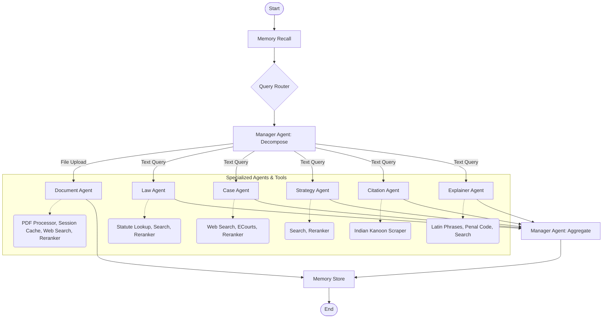

# Lex Bot v2 - Advanced Legal AI Assistant

Lex Bot v2 is a sophisticated, agentic AI system designed to assist legal professionals, students, and researchers in navigating the complexities of Indian Law. Built on a **LangGraph** architecture, it orchestrates a team of specialized AI agents to perform deep legal research, analyze case laws, formulate strategies, and explain complex concepts.

## 🏗️ Architecture & Workflow

The application uses a **Hub-and-Spoke** agentic workflow managed by a central orchestrator.

1.  **Input**: User submits a query or uploads a legal document.
2.  **Routing**: The **Query Router** analyzes the intent and complexity of the request (Simple vs. Complex) and determines which specialized agents are needed.
3.  **Decomposition**: The **Manager Agent** breaks down the user's request into specific sub-tasks for the selected agents.
4.  **Fan-Out (Parallel Execution)**: Specialized agents (Law, Case, Strategy, etc.) execute their tasks simultaneously, utilizing specific tools to gather information.
5.  **Fan-In (Aggregation)**: The Manager Agent collects all results, reranks the information based on relevance, and synthesizes a comprehensive final answer.
6.  **Memory**: Key facts and context are stored in a persistent memory layer for future interactions.

## 🤖 Specialized Agents

### 1. Manager Agent (The Orchestrator)
-   **Role**: Central coordinator.
-   **Function**: Decomposes complex queries, assigns tasks to sub-agents, and aggregates their findings into a coherent final response. It adapts its reasoning depth ("Fast" vs. "Reasoning" mode) based on the query complexity.

### 2. Law Agent (The Statute Expert)
-   **Role**: Focuses on statutory law.
-   **Function**: Searches for specific Acts, Sections, and legal provisions (e.g., IPC, CrPC, Evidence Act). It ensures that the black letter law is accurately retrieved.

### 3. Case Agent (The Precedent Researcher)
-   **Role**: Focuses on case law.
-   **Function**: Searches for relevant judgments, precedents, and case summaries from various legal databases and the web.

### 4. Strategy Agent (The Senior Advocate)
-   **Role**: Strategic analysis.
-   **Function**: Simulates a senior lawyer's thinking to develop legal strategies. It identifies key issues, formulates arguments FOR and AGAINST a position, and assesses case risks.

### 5. Citation Agent (The Shepardizer)
-   **Role**: Citation network analysis.
-   **Function**: Traces the history of a case to see how it has been cited by subsequent courts. It determines if a precedent is still "good law," distinguished, or overruled.

### 6. Explainer Agent (The Professor)
-   **Role**: Educational simplification.
-   **Function**: Explains complex legal concepts, Latin maxims, and sections in simple, accessible language suitable for students or laypeople.

### 7. Document Agent (The Analyst)
-   **Role**: Document review.
-   **Function**: Processes uploaded PDF documents (e.g., contracts, petitions), extracts text, and answers user queries specifically based on the document's content, supplemented by external web search.

## 🛠️ Tools & Capabilities

The agents are powered by a robust suite of tools:

-   **Web Search Tool**: Performs real-time searches for the latest legal developments and cases.
-   **Indian Kanoon Tool**: Scrapes and retrieves case laws and judgments from Indian Kanoon.
-   **ECourts Tool**: Interfaces with court record systems to find specific case status and orders.
-   **Penal Code Lookup**: A specialized database for quick retrieval of criminal code sections.
-   **Latin Phrases Tool**: A dictionary tool for translating and explaining legal Latin terminology.
-   **PDF Processor**: Extracts, chunks, and indexes text from PDF documents for RAG (Retrieval-Augmented Generation).
-   **Reranker**: A semantic ranking tool that ensures the most relevant search results are prioritized for the LLM's context.

## 🌍 Real-World Problems Solved

### 1. Accelerated Legal Research
*   **Problem**: Lawyers spend hours manually searching for relevant sections and case laws.
*   **Solution**: Lex Bot automates this, retrieving and synthesizing relevant statutes and precedents in seconds.

### 2. Case Strategy Development
*   **Problem**: Formulating a defense or prosecution strategy requires deep experience and foresight.
*   **Solution**: The Strategy Agent provides a structured starting point, outlining potential arguments, counter-arguments, and risks, acting as a brainstorming partner.

### 3. Precedent Verification
*   **Problem**: Relying on an overruled judgment can be fatal to a case.
*   **Solution**: The Citation Agent verifies the standing of a case, ensuring that the precedents used are valid and current.

### 4. Legal Education & Accessibility
*   **Problem**: Legal language is often impenetrable for students and the general public.
*   **Solution**: The Explainer Agent demystifies the law, making legal rights and concepts accessible to everyone.

### 5. Document Analysis
*   **Problem**: Reviewing lengthy legal documents for specific clauses or issues is tedious.
*   **Solution**: The Document Agent allows users to "chat" with their documents, instantly finding answers within hundreds of pages of text.
